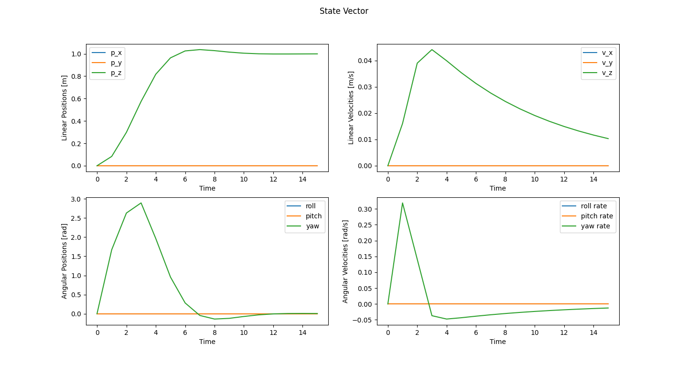
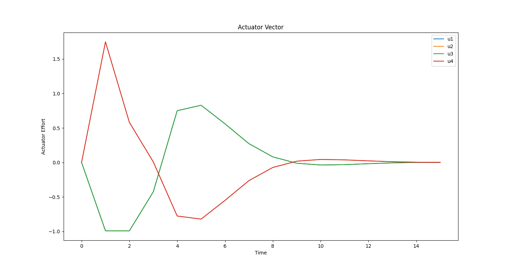
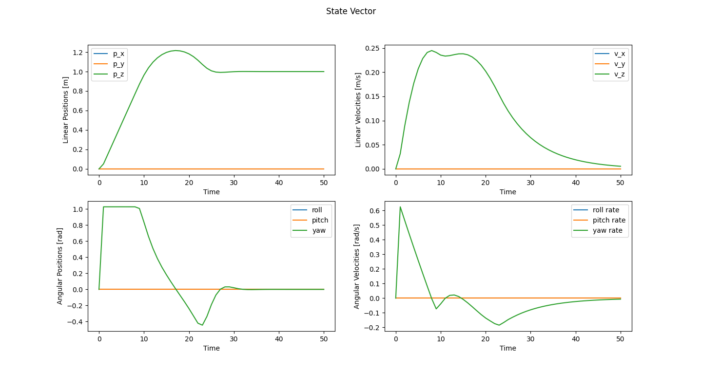
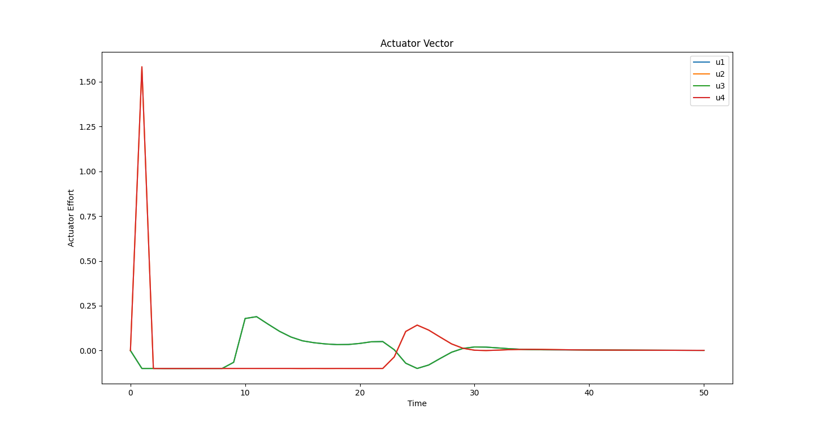

# MPC Quadcopter Simulation

- Default code from [OSQP python demo](https://osqp.org/docs/examples/mpc.html#python).
- Additional code to plot the simulated states and actuation.
- Additional code to generate c embedded code into the `osqp_gen` folder (disabled by default).

## Install OSQP

```
pip3 install osqp
```

## Run Simulation

```
python3 demo.py
```

## Generate Embedded MPC Code
1. Uncomment last line.
2. Run script
3. See [kirkrudolph/esp-osqp](https://github.com/kirkrudolph/esp-osqp-demo)

## Simulation Results #1

||
|:--:|
| Figure 1: State Vector |
||
| Figure 2: Actuator Vector |

## Simulation Results #2 (Heavily Actuator Saturated)

||
|:--:|
| Figure 1: State Vector |
||
| Figure 2: Actuator Vector: |