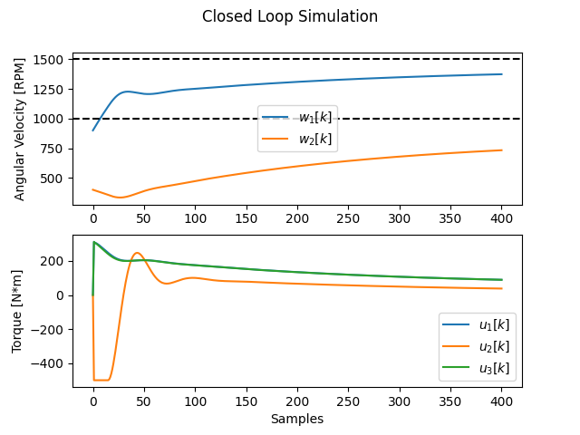
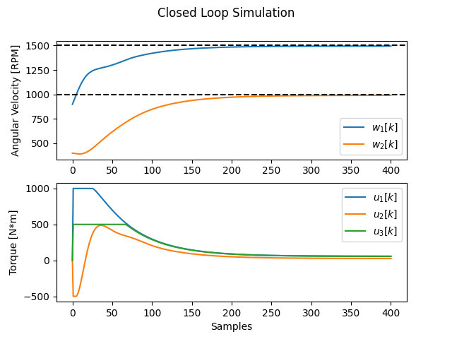

# 2 States, 3 Actuators

2nd order MIMO system.

## Complexity

Horizon = 10:

    problem:    variables n = 52, constraints m = 74
                nnz(P) + nnz(A) = 258

Horizon = 100:

    problem:    variables n = 502, constraints m = 704
                nnz(P) + nnz(A) = 2508

## Simulate

```
python3 demo.py
```

## Results

|              |
|  Figure 1: Closed loop simulation (horizon = 10)    |


|             |
|  Figure 2: Closed loop simulation (horizon = 100)   |